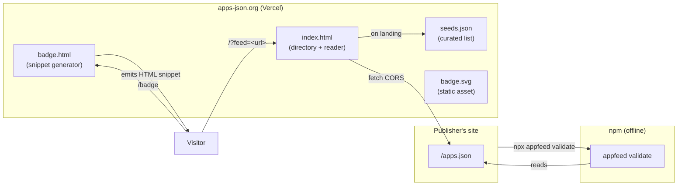

# feat: apps.json weekend ship — reader, CLI v0.1, seeded directory

## Overview

Ship the smallest bundle that proves the `apps.json` concept and pulls in
the first adopters. Three surfaces, one weekend, one repo:

1. **Reader** at `apps-json.org/?feed=<url>` — fetches any `apps.json`,
   validates it, and renders a profile-style page (author + verified
   handles + apps with version + targets). Gives every publisher an
   immediate, shareable URL.
2. **CLI v0.1** — `npx appfeed validate <url-or-path>` only. The other
   commands (`fetch`, `follow`, `list`, `update`) defer.
3. **Seeded directory** — a static page listing ~20 hand-curated feeds,
   plus a paste-ready badge generator for publishers.

The whole thing deploys from `~/Coding/apps-json/` to Vercel under the
`apps-json.org` apex. No database, no accounts, no submission form.

---

## Problem Frame

The brainstorm requirements doc concluded that a spec and an ecosystem map
are not enough on their own — publishers need an immediate, visible reward
for dropping a file at `/apps.json`. The weekend bundle is that reward
loop. It also seeds the eventual crawler with hand-curated feeds rather
than open-web spam (see origin: `docs/brainstorms/2026-04-30-apps-json-requirements.md` → "Smallest viable shipment").

The 30-day adoption test is binary: at least 5 unaffiliated feeds appear,
or the project is mothballed gracefully. This bundle is the test.

---

## Requirements Trace

- R1. Publishers can drop a file at `/apps.json` and immediately get a
  rendered profile page at `apps-json.org/?feed=<url>`. Maps to origin
  Goal "publish a valid feed in 60 seconds" and Success criterion S1.
- R2. `npx appfeed validate <url-or-path>` validates a feed against the
  v1.0 schema and exits 0 (success), 1 (schema errors), or 2 (network
  error). Maps to origin Goal "reference CLI that lets early adopters
  validate".
- R3. Visitors to `apps-json.org` see a curated directory of ~20 seeded
  feeds with no submission step.
- R4. Publishers get a paste-ready badge snippet (`<a>` tag pointing to
  the reader) for their site footer or README.
- R5. The seeded directory is reproducible — seeds tracked as a checked-in
  JSON file, additions via PR. No database.
- R6. Site, CLI source, and spec all live in one repo and deploy on push.

---

## Scope Boundaries

### Deferred for later

*Carried from origin requirements doc.*

- `appfeed follow`, `list`, `update` commands. v0.1 ships `validate` only.
- Crawler infrastructure of any kind. Discovery in v1 is "I sent you the
  URL".
- Web search across feeds (`apps.fyi`-style). Tier-2 in the ecosystem map.
- Family-tree visualizer for `replaces` chains. Tier-3.
- Install buttons fully wired for non-web targets (claude-skill, macOS,
  etc.). v1 renders them as labels with copy-link affordance only.
- Authenticated/private feeds. Out of scope; HTTP auth at the publisher's
  layer is sufficient when needed later.
- Hosted submission form for adding feeds to the seeded directory. PRs
  are the submission mechanism.

### Outside this product's identity

*Carried from origin requirements doc — adjacent products this bundle must
not accidentally build.*

- A central registry or any submission gate that validates author identity
  before inclusion. Verification is the agent's responsibility (per spec).
- A monetization, marketplace, or transaction surface.
- A rating, review, or comment system.
- A platform-specific reader (e.g., "for Claude Skills only"). The reader
  must render any valid `apps.json` regardless of `targets[]` mix.

### Deferred to Follow-Up Work

- **Domain registration of `apps-json.org`** — must happen before deploy.
  Plan assumes the domain is acquired (~$15/yr at any registrar). If the
  exact name is unavailable, fall back to `appsjson.org` or
  `apps-json.dev`; reader and badge URLs adjust at deploy time, no code
  change needed.
- **CLI publication to npm** — requires an npm account and a name check.
  If `appfeed` is taken, publish under `@apps-json/cli` and document
  `npx @apps-json/cli validate` in README. This is a follow-up after the
  CLI source lands; site can ship without it.
- **Recruiting the 20 seed publishers** — operational work, runs in
  parallel with code. Tracked in U6.

---

## Context & Research

### Relevant Code and Patterns

- `~/Coding/apps-json/spec/apps.schema.json` — the v1.0 schema, already
  validates clean against `spec/apps.example.json`.
- `~/Coding/apps-json/spec/SPEC.md` — human-readable spec the reader must
  link to.
- `~/Coding/apps-json/appfeed/README.md` — CLI scaffold. The `validate`
  stub there is the starting point for U3.
- Brian's other Vercel projects (e.g., `~/Coding/circles/`) follow a
  Vite + GitHub-push-deploys pattern. The weekend bundle uses simpler
  static deploy (no Vite needed for the reader), but reuses the same
  Vercel project / domain link conventions.

### Institutional Learnings

- Greenfield repo in `~/Coding/`. No `docs/solutions/` to mine.
- Brian's `tasks/lessons.md` rule: weekday-date pairings need
  `date -j -f` verification. No date-pairing in this plan beyond the
  filename header (already verified: 2026-04-30 = Thursday).

### External References

- Vercel static deployment: standard `vercel.json` + a single rewrite for
  the reader query-string entry.
- npm bin scripts: standard `"bin"` + shebang `#!/usr/bin/env node` setup
  for `appfeed`.
- ajv 8 + ajv-formats: only used in the CLI. The browser reader uses a
  hand-rolled minimal validator (justification in Key Technical Decisions).

---

## Key Technical Decisions

- **Reader is a single static HTML page, no build step.** The whole
  reader fits in one HTML file plus one JS module plus one CSS file.
  Loaded directly by Vercel as static. Rationale: the reader's job is to
  fetch one JSON file and render it. A bundler would add carrying cost
  for zero user benefit. If the reader ever grows, migrating to Vite is
  a one-evening job.
- **Browser-side validator is hand-rolled, not ajv.** The v1.0 surface
  is small (top-level `version` + `apps[]`, per-app `name` + `url`, plus
  optional fields with simple shapes). A 60-line validator covers it
  better than a 100KB ajv bundle. The CLI uses ajv for ground truth;
  the browser validator's job is "good error messages on the common
  failures," not full Draft 2020-12 compliance.
- **CLI is plain JavaScript ESM, not TypeScript.** v0.1 has one command
  and ~150 LOC. TS adds a build step for no readability gain at this
  scale. If/when the CLI grows past `validate`, migrating to TS is a
  contained refactor.
- **Vercel for deploy.** Brian already runs on Vercel; the
  vercel:deployments-cicd skill handles the workflow. Apex domain
  `apps-json.org` + automatic preview URLs per branch.
- **Seeds are a checked-in JSON file** at `site/seeds.json`, not a
  database or external service. Adding a feed is a PR; the static page
  reads `seeds.json` at page load and renders.
- **Two badge formats, both available from day 1.** A static SVG at
  `apps-json.org/badge.svg` (zero-runtime) AND a re-validating link at
  `apps-json.org/?feed=<url>` (live status). The badge generator emits
  the link form by default and offers the SVG as a "no-runtime" option.
- **One repo, one Vercel project, one deploy pipeline.** Site lives at
  `site/`, CLI source stays at `appfeed/`, spec stays at `spec/`. Vercel
  builds only `site/`; the CLI publishes to npm separately.

---

## Open Questions

### Resolved During Planning

- **CLI naming.** Ship as `appfeed`; if the npm name is taken, fall back
  to `@apps-json/cli` and update README. Decided at publish time, not
  blocking on the question.
- **`.well-known/apps.json` alternate path.** Reader's URL fetcher tries
  `<host>/apps.json` first, then `<host>/.well-known/apps.json` on 404.
  Spec stays single-path; reader is permissive.
- **Badge format.** Both forms shipped (see Key Technical Decisions).

### Deferred to Implementation

- **Exact npm name when published.** Verified at publish time, fall-back
  logic above.
- **Apex vs `www.` redirect direction.** Vercel default; pick whichever
  is cleaner during deploy.
- **Render order of `targets[]`.** Reader sorts by familiarity at first
  (`web` first, then `claude-skill`, then everything else by appearance
  order). May tune after seeing real feeds.
- **What to do with unknown `target.kind` values.** Per spec: render the
  label with a generic "open URL" affordance. Exact icon choice is a
  styling detail, not a planning decision.

---

## Output Structure

```
~/Coding/apps-json/
├── README.md                                   (exists)
├── vercel.json                                 (NEW — site deploy config)
├── spec/                                       (exists)
│   ├── SPEC.md
│   ├── apps.schema.json
│   └── apps.example.json
├── appfeed/                                    (exists)
│   ├── README.md
│   ├── package.json                            (NEW — npm package manifest)
│   ├── bin/
│   │   └── appfeed.js                          (NEW — CLI entry, shebang)
│   ├── src/
│   │   └── validate.js                         (NEW — validate command)
│   └── test/
│       └── validate.test.js                    (NEW — node --test)
├── site/                                       (NEW — the reader)
│   ├── index.html                              (NEW — directory + reader entry)
│   ├── reader.js                               (NEW — fetch + validate + render)
│   ├── validator.js                            (NEW — hand-rolled browser validator)
│   ├── render.js                               (NEW — feed → DOM)
│   ├── badge.html                              (NEW — badge generator page)
│   ├── badge.js                                (NEW — snippet generation)
│   ├── styles.css                              (NEW — single stylesheet)
│   ├── seeds.json                              (NEW — curated feed list)
│   ├── badge.svg                               (NEW — static badge asset)
│   └── favicon.svg                             (NEW)
├── docs/
│   ├── ECOSYSTEM.md                            (exists)
│   ├── brainstorms/
│   │   └── 2026-04-30-apps-json-requirements.md  (exists)
│   └── plans/
│       └── 2026-04-30-001-feat-apps-json-weekend-ship-plan.md  (this file)
└── seeding/                                    (NEW — operational, not deployed)
    ├── candidates.md                           (NEW — 20-name recruit list)
    └── drafts/                                 (NEW — seed feeds for friends)
        └── *.apps.json
```

The implementer may adjust this layout if implementation reveals a better
structure. The per-unit `**Files:**` sections are authoritative.

---

## High-Level Technical Design

> *This illustrates the intended approach and is directional guidance for review, not implementation specification.*



The reader is a single page that switches mode based on the query string:
no `?feed` → render the seeded directory from `seeds.json`. With `?feed` →
fetch that URL, validate it, render the profile.

---

## Implementation Units

- U1. **Site scaffold + Vercel deploy**

**Goal:** Stand up an empty `site/` that deploys to a Vercel preview URL,
so subsequent units land on real infrastructure rather than localhost.

**Requirements:** R1, R6.

**Dependencies:** None. (Domain registration is a parallel operational
prerequisite — the preview URL works without it.)

**Files:**
- Create: `site/index.html` (placeholder body)
- Create: `site/styles.css` (empty starter)
- Create: `site/favicon.svg`
- Create: `vercel.json`

**Approach:**
- `vercel.json` declares `site/` as the output directory and rewrites
  any path with a `?feed` query to `index.html` (Vercel's default for
  static already does this; explicit rewrite is belt-and-suspenders).
- Set `Cache-Control` on `index.html` to a short value (e.g.,
  `public, max-age=300, must-revalidate`) so the reader updates fast as
  development continues.
- Connect the GitHub repo to Vercel. Production branch = `main`. Preview
  per branch.
- Apex domain `apps-json.org` configured if registered; otherwise note
  the Vercel-assigned URL in README.

**Patterns to follow:**
- Brian's existing Vercel-linked projects in `~/Coding/`. Use
  `vercel:bootstrap` skill if convenient for the link step.

**Test scenarios:**
- *Happy path.* Pushing to `main` produces a deployed page at the Vercel
  URL within 90 seconds, returning HTTP 200 on `/`.
- *Edge case.* Visiting `/?feed=https://example.com` returns the same
  `index.html` (Vercel rewrite working).
- Test expectation: manual verification only — no automated test for
  this scaffold unit.

**Verification:**
- The Vercel preview URL serves `index.html` at root.
- The query-string variant returns the same HTML, not a 404.
- DNS for `apps-json.org` resolves to Vercel (only if domain registered).

---

- U2. **Browser validator + reader render path**

**Goal:** With a `?feed=<url>` query, fetch the URL, validate it, and
render either a clean profile page or actionable error messages.

**Requirements:** R1.

**Dependencies:** U1.

**Files:**
- Create: `site/reader.js` (entry — wires query string → fetch → validate → render)
- Create: `site/validator.js` (hand-rolled validator for v1.0 surface)
- Create: `site/render.js` (feed object → DOM)
- Modify: `site/index.html` (add reader bootstrap)
- Modify: `site/styles.css` (profile + error styles)
- Test: `site/validator.test.html` (browser-based test page that runs validator over fixtures)

**Approach:**
- `reader.js` reads `location.search`, parses `feed`, normalizes the URL
  (add `https://` if missing scheme, append `/apps.json` if path is
  bare). Tries the given URL first; on 404, retries with
  `/.well-known/apps.json`.
- `validator.js` enforces only the v1.0 hard contract: top-level
  `version === "1.0"`, `apps` is an array, each app has `name` (string,
  non-empty) and `url` (parseable as URL). Everything else is best-effort
  warnings, not errors. Returns `{ ok: boolean, errors: [], warnings: [] }`.
- `render.js` produces the profile DOM:
  - Header: `author.name` + `author.url` linkified + each
    `social[]` rendered as a chip (handle if present, host otherwise).
  - For each app: name (h2), description, version + updated badge, tags,
    and a "Targets" row with a button per `targets[]` entry (button text
    from `target.label` or fallback to `target.kind`). Unknown kinds
    render with a generic icon, button still works.
  - Provenance row when present: `vibe_coded` chip, `prompt_log` link,
    `forkable` chip + `source` link, `replaces` link.
- Errors render as a card with the URL attempted, the failure (network,
  parse, schema), and a copy-pasteable diagnostic line for issue
  reports.
- Network failure is silent for users-without-CORS — `reader.js` emits
  a remediation line ("publisher needs to add `Access-Control-Allow-Origin: *`").

**Patterns to follow:**
- Vanilla DOM. No framework. Use `document.createElement` + a small
  helper `el(tag, attrs, ...children)` for readability.
- Keep `validator.js` pure (no DOM access) so it's reusable for the
  badge page's "is this URL a valid feed?" preview.

**Test scenarios:**
- *Happy path.* `validator(specExample)` returns `{ ok: true }`.
- *Happy path.* Rendering the spec example produces a heading with the
  author name, a card per app, and target buttons whose `href`s match
  `targets[].url`.
- *Edge case.* Feed with `apps: []` renders the author header + an
  "(empty feed)" placeholder; no errors.
- *Edge case.* Feed with unknown `target.kind` renders the label with a
  generic affordance; validator does not raise.
- *Edge case.* Feed with `targets` missing on an app falls back to top-level
  `url` for the launch button.
- *Error path.* Feed missing `version` shows an inline error
  ("required: `version`"); page does not throw.
- *Error path.* Feed where `apps[0].url` is not a parseable URL surfaces
  a per-app error and renders the rest of the feed.
- *Error path.* `?feed=` empty / absent shows the directory landing
  page (handled by U4); reader.js bails early.
- *Error path.* CORS-blocked fetch surfaces the "publisher must allow
  CORS" remediation message.
- *Integration.* Loading `?feed=<vercel-url>/_test/example.json` in a
  headless browser produces a DOM containing all three example apps.

**Verification:**
- Loading the live site with `?feed=<URL of spec/apps.example.json on Vercel>`
  renders the example author's profile with the example apps.
- Loading with a deliberately broken feed shows useful errors, not a
  blank page.

---

- U3. **CLI v0.1 — `appfeed validate`**

**Goal:** Ship `npx appfeed validate <url-or-path>` so motivated
publishers can lint feeds locally before publishing.

**Requirements:** R2.

**Dependencies:** None (parallel to U1/U2).

**Files:**
- Create: `appfeed/package.json`
- Create: `appfeed/bin/appfeed.js` (shebang entry, dispatches to commands)
- Create: `appfeed/src/validate.js` (the only command in v0.1)
- Create: `appfeed/test/validate.test.js`
- Modify: `appfeed/README.md` (mark v0.1 published, link to npm)

**Approach:**
- `bin/appfeed.js`: parse `argv` with `commander`. Register only
  `validate <urlOrPath>`. Unknown commands print a "coming soon" stub
  listing `fetch`, `follow`, `list`, `update` as deferred.
- `src/validate.js`:
  - Loader accepts `https?://` URLs (uses built-in `fetch`, follows
    redirects, sends `User-Agent: appfeed/0.1 (+https://apps-json.org)`)
    or a local file path.
  - Validates with `ajv` strict + `ajv-formats`. Schema bundled at
    publish time by copying `../spec/apps.schema.json` into
    `appfeed/src/schema.json` via a `prepublish` step.
  - Output format: green check + summary on success, red `✖` + per-error
    JSON Pointer + message on failure. `--json` flag emits machine-readable.
- Exit codes: 0 success, 1 schema errors, 2 network/parse errors.
- ESM (`"type": "module"`), Node 22+ engines field.

**Patterns to follow:**
- Standard `commander` CLI shape. `bin/appfeed.js` should be ~30 lines.
- `picocolors` for terminal color. No `chalk`.

**Test scenarios:**
- *Happy path.* `validate spec/apps.example.json` exits 0 with "valid"
  message.
- *Happy path.* `--json` flag produces parseable JSON with `{ ok: true,
  errors: [], appCount: 3 }`.
- *Edge case.* File with extra unknown top-level field validates clean
  (`additionalProperties: true` honored).
- *Edge case.* Empty `apps: []` validates clean.
- *Error path.* File missing `version` exits 1 and prints
  `/version` JSON Pointer.
- *Error path.* File missing `apps[0].url` exits 1 and prints
  `/apps/0` location.
- *Error path.* Invalid JSON exits 2 with parse-error message.
- *Error path.* HTTP 404 on a URL exits 2 with the URL and status.
- *Error path.* Network failure (ENOTFOUND, timeout) exits 2 with the
  error code, not a stack trace.

**Verification:**
- `node bin/appfeed.js validate ../spec/apps.example.json` prints
  success.
- `node bin/appfeed.js validate https://briandell.xyz/apps.json`
  works once Brian's feed exists (U6).
- `node --test test/` passes.

---

- U4. **Seeded directory landing page**

**Goal:** When a visitor arrives at `apps-json.org/` with no `?feed`
parameter, render a directory of curated feeds rather than the reader.

**Requirements:** R3, R5.

**Dependencies:** U1, U2 (reuses validator + renderer for inline previews).

**Files:**
- Create: `site/seeds.json` (initial: 5 self-authored seeds, see U6)
- Modify: `site/index.html` (add directory mode markup)
- Modify: `site/reader.js` (no-`?feed` branch loads seeds and renders directory)
- Modify: `site/render.js` (add `renderDirectory(seeds)` helper)
- Modify: `site/styles.css` (directory grid styles)

**Approach:**
- `seeds.json` schema: `{ "version": 1, "feeds": [{ "url": "...",
  "note": "..." (optional) }] }`. Note is curator commentary, not
  carried into the feed itself.
- On directory load, fetch `seeds.json` (same-origin), then for each
  seed kick off a parallel fetch of the feed URL and render a card
  showing author name + app count + last `updated`.
- Failed fetches render a card with "couldn't reach feed" rather than
  hiding the entry. Honesty over polish.
- Each card links to `?feed=<seed-url>` for the full profile.
- Add a top-of-page "Add yours" link pointing to the GitHub PR
  workflow on `seeds.json`.

**Patterns to follow:**
- Reuse `validator.js` to mark feeds as ✓ valid or ⚠ has issues in the
  card metadata. Light touch — no full error display in the directory
  view.

**Test scenarios:**
- *Happy path.* Visiting `/` with `seeds.json` containing 3 valid feeds
  renders 3 cards, each linked to `?feed=<url>`.
- *Edge case.* Empty `seeds.json` (no feeds) renders an empty state with
  a "submit yours" call-to-action.
- *Edge case.* Seed with unreachable URL renders a "couldn't reach"
  card with the URL displayed for transparency.
- *Edge case.* Seed pointing to invalid feed renders the card with a
  ⚠ marker but does not break the page.
- *Integration.* Click on a seed card navigates to `?feed=<url>` and
  the reader from U2 renders the profile.

**Verification:**
- The directory page renders with the 5 self-authored seeds.
- Each card links correctly to its profile view.
- A deliberately-broken seed entry surfaces the issue without breaking
  the page.

---

- U5. **Badge generator + static badge asset**

**Goal:** Give publishers a paste-ready snippet they can drop into their
site footer or README.

**Requirements:** R4.

**Dependencies:** U1.

**Files:**
- Create: `site/badge.html` (the generator page)
- Create: `site/badge.js` (snippet generation logic)
- Create: `site/badge.svg` (static "apps.json ✓" badge asset)
- Modify: `site/index.html` (link to /badge in directory page footer)

**Approach:**
- `/badge` form: input field for the publisher's `apps.json` URL.
- Live preview pane shows the rendered badge AND a copy-button next to
  the snippet textarea.
- Two snippet variants offered, both generated client-side:
  - **Live link.** `<a href="https://apps-json.org/?feed=<url>"></a>`. Re-runs
    validation each time someone clicks (because the reader does).
  - **Static SVG only.** ``. No runtime check; cheaper for the publisher.
- `badge.svg`: a small (~120×24px) SVG showing "apps.json ✓" in a tasteful
  style. Inline text, no external font.
- Optional: when the input URL is valid (per `validator.js`),
  the page shows a green check next to the input. Best-effort.

**Patterns to follow:**
- Reuse `validator.js` for the input-validation preview.
- Plain DOM, no framework.

**Test scenarios:**
- *Happy path.* Input `https://ada.example/apps.json` produces a
  snippet whose `href` contains exactly that URL, URL-encoded.
- *Happy path.* The static-SVG snippet is a single `` tag and
  contains no `<a>`.
- *Edge case.* Input with embedded query string (`?` characters) is
  URL-encoded correctly in the snippet.
- *Edge case.* Empty input renders no snippet (or a placeholder).
- *Error path.* Input that is not a valid URL surfaces a warning beside
  the input but does not block snippet generation (publishers may want
  to generate before their feed is live).
- *Integration.* Pasting the generated snippet into a fresh HTML doc
  and opening it shows the badge image and links correctly to the
  reader.

**Verification:**
- `/badge` loads with an empty form.
- Entering a URL and clicking copy produces a snippet that, when pasted
  into a test HTML page, renders the badge linking back to the reader.
- `apps-json.org/badge.svg` returns 200 with `image/svg+xml`.

---

- U6. **Seed feeds + recruit list (operational)**

**Goal:** Hand-author 5 `apps.json` files for friends so the directory
isn't empty on launch, and assemble the 20-name list of priority
publishers to recruit in week one.

**Requirements:** R3, R5.

**Dependencies:** U1 (need a deploy URL to share). Authoring can start
in parallel with U1–U5.

**Files:**
- Create: `seeding/candidates.md` (20 priority recruits with channel +
  archetype tag, NOT in the deployed site)
- Create: `seeding/drafts/<host>.apps.json` × 5 (drafts for friends, not
  yet hosted on their sites)
- Modify: `site/seeds.json` (add the 5 self-authored seeds once they're
  hosted somewhere — friend's site, gist, or initially served from
  `apps-json.org/seeded/<host>.apps.json` if a friend hasn't deployed
  yet)
- Modify: `site/index.html` (footer: "submit yours" link to GitHub repo's
  `seeds.json`)

**Approach:**
- Brian writes 5 sample feeds informed by his existing relationships:
  Simon Willison-shaped solo builders, Claude skill curators, indie SaaS
  founders. Each draft validates with `appfeed validate`.
- Drafts are sent to each subject as a one-paragraph pitch + the file +
  a link to the rendered profile (using `apps-json.org/?feed=<url>`).
  Subjects either host the file themselves or grant permission for
  `apps-json.org` to host it under `/seeded/<host>.apps.json` until they
  do.
- `candidates.md` is a 20-row list: name | channel (twitter/email) |
  archetype (per ecosystem map) | hosted-feed-yet | follow-up date.
  This is the recruit list for week one.

**Patterns to follow:**
- Brian's `/outreach` skill conventions for the recruitment messaging.
  Each pitch ≤ 5 sentences. No demand for the recipient to do work
  beyond reviewing the draft and flipping a file.

**Test scenarios:**
- Test expectation: none — operational/content unit. Validation of the
  drafts is covered by U3's `appfeed validate` (each draft must pass).

**Verification:**
- 5 draft feeds in `seeding/drafts/` all pass `appfeed validate`.
- The directory at `apps-json.org/` renders 5 cards.
- `seeding/candidates.md` lists 20 names with archetype tags.
- At least 5 of the 20 have either confirmed or hosted their feed within
  one week of launch (this is the success-criteria target from origin).

---

## System-Wide Impact

- **Interaction graph.** The reader, the directory, and the badge
  generator all share `site/validator.js`. A change to the validator
  affects all three. The CLI uses ajv on the same schema; ground truth
  divergence between hand-rolled validator and ajv is a real risk
  (mitigated by sharing test fixtures).
- **Error propagation.** Network failures in the reader and directory
  must not throw past their entry points. Each surface degrades
  gracefully (broken feed renders an error card, not a blank page).
- **State lifecycle risks.** None at runtime — no persistent state in
  v0.1. The seeded directory is read-only at runtime; updates land via
  PR.
- **API surface parity.** The published spec at
  `apps-json.org/spec` (a static rendering of `spec/SPEC.md`) and the
  schema at `apps-json.org/schemas/v1.json` (a static copy of
  `spec/apps.schema.json`) become public URLs. Once published they
  are externally referenced; do not move them.
- **Integration coverage.** The U2 integration scenario (loading a
  Vercel-hosted example feed in a headless browser and asserting DOM)
  is the primary cross-layer test. The CLI's `validate <https-url>`
  test (U3) covers the network-fetch path that mocks alone won't prove.
- **Unchanged invariants.** The spec, schema, and example file land
  intact — this plan does not modify them. The CLI scaffold's
  `appfeed/README.md` content is updated only to mark v0.1 as
  published; the surface-area documentation it carries (commands,
  layout) stays as the source of truth for future v0.x work.

---

## Risks & Dependencies

| Risk | Likelihood | Impact | Mitigation |
|------|-----------|--------|------------|
| Domain `apps-json.org` is unavailable or already squatted | Med | Med | Fallback names already chosen (`appsjson.org`, `apps-json.dev`). All URLs are deploy-time configurable. |
| `appfeed` is taken on npm | Med | Low | Fallback to `@apps-json/cli`. Documented in U3. |
| Hand-rolled browser validator diverges from ajv ground truth | Low | Med | Share `spec/apps.example.json` and a `test-fixtures/` dir as ground-truth corpora. Both validators must agree on every fixture. |
| CORS-blocked publisher feeds (most static hosts default to no-CORS) | High | Med | Reader's error path explicitly tells the publisher how to fix it. Add a one-paragraph "CORS for `apps.json`" section to `SPEC.md` referencing it. |
| Fewer than 5 friends host their feeds in week 1 | Med | High | Origin requirements set this as the 30-day mothball signal. Mitigation is recruitment quality (U6), not technical. Set a calendar reminder for day 30. |
| Reader UX feels generic and doesn't pull anyone in | Med | Med | Dedicate a meaningful slice of the weekend to design polish on the profile page. Render Brian's own feed first as the hero example. |
| Provenance fields (`vibe_coded`, `prompt_log`) get treated as required by aggregators | Low | Med | Reader explicitly renders feeds without provenance fields cleanly, so the absence isn't a status warning. SPEC.md states they're optional in bold. |
| Spec page on `apps-json.org/spec` becomes load-bearing for external sites; future spec changes break inbound links | Med | Low | Pin v1 spec at `apps-json.org/spec/v1` from day one. Future versions get their own paths; `/spec` redirects to current. |

---

## Documentation / Operational Notes

- **Site copy.** `site/index.html` should explain the format in 2-3
  sentences above the directory grid. The full SPEC link is in the
  header. No marketing copy — let the rendered feeds speak.
- **README updates.** `~/Coding/apps-json/README.md` gains a "Live at
  apps-json.org" badge once deployed.
- **Spec hosting.** Render `spec/SPEC.md` to HTML at
  `apps-json.org/spec` (Vercel can serve a markdown-rendered version
  via a tiny build script or — simpler — a hand-written HTML wrapper
  that loads the markdown and renders client-side via marked.js or
  similar). Defer the rendering implementation as a sub-task of U1.
- **Day-30 review.** Run `appfeed validate` against every URL in
  `site/seeds.json` and scan for unaffiliated feeds (feeds whose author
  Brian hasn't personally pitched). If unaffiliated count < 5, escalate
  to mothball decision per origin success criteria.
- **No analytics in v0.1.** Out of scope. Vercel's anonymized request
  logs are sufficient.

---

## Sources & References

- **Origin document:** `docs/brainstorms/2026-04-30-apps-json-requirements.md`
- Spec: `spec/SPEC.md`
- JSON Schema: `spec/apps.schema.json`
- Example feed: `spec/apps.example.json`
- CLI scaffold (pre-v0.1): `appfeed/README.md`
- Ecosystem map: `docs/ECOSYSTEM.md`
- Vercel deployment guidance: load `vercel:deployments-cicd` skill at
  deploy time.
- Vercel project bootstrap: load `vercel:bootstrap` skill at link time.
